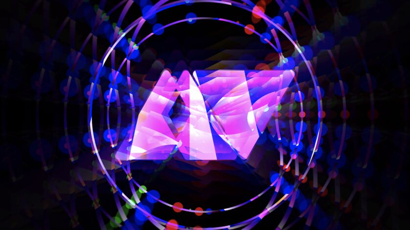

<h1>modV Workshop</h1>

> By using the open source software [modV](https://modv.vcync.gl/) you will be able to create audio reactive visualisations by combining different kinds of visual modules (2D, [Interactive Shader Format](https://isf.video/) and WebGL Shader) with any kind of audio input like a microphone or your favorite music. In the end you will know all the basics in order to do your first live performance as a VJ.

---

- [Prepare before the Workshop](#prepare-before-the-workshop)
  - [modV setup](#modv-setup)
  - [Audio Routing](#audio-routing)
  - [Download / clone the repository](#download--clone-the-repository)
- [1. History of modV](#1-history-of-modv)
  - [Who is behind modV?](#who-is-behind-modv)
  - [Where is modV being used?](#where-is-modv-being-used)
- [2. How to use modV](#2-how-to-use-modv)
  - [User Interface](#user-interface)
  - [Menu](#menu)
  - [Rearrange the panel layout](#rearrange-the-panel-layout)
  - [Add a module to a group](#add-a-module-to-a-group)
    - [Text](#text)
  - [Change group options (inherit + clearing)](#change-group-options-inherit--clearing)
    - [Waveform](#waveform)
    - [Webcam](#webcam)
  - [Save / Load a preset](#save--load-a-preset)
  - [Change the alpha / blending of a group](#change-the-alpha--blending-of-a-group)
    - [Add another group](#add-another-group)
- [Breakout Session A](#breakout-session-a)
  - [Add images into modV](#add-images-into-modv)
  - [Add modules into modV](#add-modules-into-modv)
    - [Module licence](#module-licence)
    - [Add ISF shader into modV](#add-isf-shader-into-modv)
    - [Use blending to make logo visible](#use-blending-to-make-logo-visible)
- [3. Use Audio in modV](#3-use-audio-in-modv)
  - [Audio processing in modV](#audio-processing-in-modv)
  - [Audio routing](#audio-routing-1)
  - [Audio reactive visuals](#audio-reactive-visuals)
- [Breakout Session B](#breakout-session-b)
- [4. Techniques to get certain effects](#4-techniques-to-get-certain-effects)
  - [Tunnel effect](#tunnel-effect)
  - [Background fade](#background-fade)
  - [Using a group as mask (text)](#using-a-group-as-mask-text)
  - [Hue rotation for trailing colors](#hue-rotation-for-trailing-colors)
- [Breakout Session C](#breakout-session-c)
- [5. Use modV for a live performance](#5-use-modv-for-a-live-performance)

---

# Prepare before the Workshop

If you have problems to prepare for the workshop, please make sure to reach out to us: [Tim Pietrusky](https://nerddis.co) or [Sam Wray](https://2xaa.fm)!

## modV setup

Install the [latest version of modV](https://github.com/vcync/modV/releases/latest). 

When you start modV, two windows should open: The **main window** and the **output window**. 

*modV main window*

*modV output window*

## Audio Routing

In order to get audio into modV to be able to visualize it, you need to [follow one of these guides for your operating system](https://modv.vcync.gl/v3/guide/#audio-routing). 

When everything works out, you can select your Audio Input under **Input Device Config**

*Audio Input Config*

If it doesn't work out, you can still use the microphone of your computer!

## Download / clone the repository

In order to get all files that are needed for the workshop, please [download](https://github.com/vcync/modV-Workshop/archive/main.zip) or clone the repository to your computer. 

The important folders are:

* [modules](/modules): Example modules to extend modV
* [presets](/presets): Configurations that will be used during the workshop

---

# 1. History of modV

In this workshop we are using modV 3.x, the latest version of modV that comes as a standalone desktop application. With modV, you can combine modules with each other to generate visual output. Every module has properties that can be updated in real time to change how the module is drawn. Each of these properties can also be updated automatically using audio features based on audio input (e.g. a microphone). 

## Who is behind modV?

* [Sam Wray](https://2xaa.fm), founder and core contributor
* [Tim Pietrusky](https://nerddis.co), core contributor

We are using modV for shows around the world for more than 4 years. 

## Where is modV being used?

* [Various videos & images of modV in action](https://photos.google.com/share/AF1QipPhz8zKecemmMxnMbFdhFo-__tSmrmqMQzrD4YkE1MUFq-FQxqgePMFure5h05SfA?key=eDRWNVhnVjE4SXU5N0xSNVpBQkw0SmRxQ0JCZjFn)
* [Performance of 2xAA & NERDDISCO for OPEN UP SUMMIT 2020 using modV 3.x](https://www.youtube.com/watch?v=RhM3arvVAPM)
* [A talk about modV 2.x at dotJS 2016](https://www.youtube.com/watch?v=GA7-OfYSzvA)

---

# 2. How to use modV

Before we dive into creating audio reactive visuals, we want to explain how the UI of modV is structured so we can talk about the same things. 

## User Interface

* **A**: `Groups`. A Group contains modules. Modules within Groups can be arranged to change the drawing order. 
* **B**: `Module`. A module represents a visual element that draws something to the screen, like the `Text` module that can draw any kind of user generated text to the `Main Output`
* **C**: `Info View`. Shows information about the different panels in modV when you hover over them using your mouse. 
* **D**: `Gallery`. Contains all modules that can be added to a `Group`. Modules are categorized as `2D` (Canvas 2D), `ISF` (Interactive Shader Format) and `Shader` (WebGL Shader / GLSL). You can either scroll the list or use the search box at the top to find a specific module. 
* **E**: `Input config`.  The panel allows creation of Input Links. Select a `Module Control` in the `Module Inspector`, then use the `Input Config` to assign an `Audio Feature`, `MIDI control` or `Tween` to automate the Module Control.
* **F**: `Property Inspector`
* **G**: `Preview`
* **H**: `Input Device Config`

## Menu

There are multiple menu elements, but the most important ones are `File` and `View`:

* `File`
  * `Open Preset`: Load a preset from your computer into modV
  * `Save Preset`: Save a preset as JSON onto your computer that contains all groups, modules & settings of what you have created in modV
  * `Open Media Folder`; Uses your default application for exploring files (e.g. Finder on MacOS or Explorer on Windows) to open the `media` folder of modV. There you can put your images or third-party modules.
* `View`
  * `New Output Window`: Opens the output window if this was closed. 
  * `Reload`; As modV is a web application we can reload modV as we can reload any website in order to get a clean state.

## Rearrange the panel layout

Every panel in modV can be dragged and placed into different positions. This makes it possible to create any layout you want and feel comfortable with. 

* Move the `Info view` by clicking on it's title (keep the mouse button pressed) and dragging it onto the title of the `Gallery`. When you release the mouse button again, you can drop the `Info View` as a second tab besides the `Gallery`
* To give the `Gallery` even more space, we can click (keep the mouse button pressed) on the border between the `Gallery` and the `Input config`. Then we can move the mouse to the right to make the `Gallery` wider

## Add a module to a group

Now let's get some visual output. 

### Text

* Find the `Text` module in the `Gallery`, either by enterting the modules name into the search box or by scrolling trough the list of modules (hint: It's a `2D` module)
* Double click the module to add it to the active group or drag and drop it into the group you want it

## Change group options (inherit + clearing)

### Waveform

### Webcam

This will only work if you have a second webcam or not use your webcam inside of a video chat (e.g. Zoom)

## Save / Load a preset

tbd

## Change the alpha / blending of a group

### Add another group

---

# Breakout Session A

* Play around with modV and get used to the UI
* TODO: Add module x and do y to get effect z

---

## Add images into modV

In order to get an image into modV, you have to find the [media folder](https://modv.vcync.gl/v3/guide/media.html#media-folder) on your computer. 

After you have located the media folder, you can [follow the steps to add the image](https://modv.vcync.gl/v3/guide/media.html#using-an-image):

1. Add the image into the `image` folder
2. Add the `Texture 2D` module into a group
3. In the property-inspector for the module select `image` in the `texture` property, which adds a new list underneath
4. In the list, select the image you added into the `image` folder

---

## Add modules into modV

The biggest power over modV is that you can extend it with your own or other third-party modules as modV supports different kind of visual sources. So let's see how this can be done. 

### Module licence

* Taking stuff from other people
   * Shadertoy License
   * CodePen License
   * Make clear that taking resources from someone else should always be credited as we don’t want to steal anyone's work AND check the license

### Add ISF shader into modV

For this workshop we are collaborating with [ilithya](https://twitter.com/ilithya_net) and [eliza](https://twitter.com/iamelizasj) which means we can use their awesome "[Movement](https://codepen.io/ilithya/pen/poyMNvG)" shader to show how audio reactivity works. As the file should only be used in this workshop, we will provide the URL to shader when the actual workshop happens. For everyone else doing this tutorial, you can pick one of the [modules](/modules) in the repository. 

* Load the shader from Diana & Eliza
* ISF
   * Provide a guide on how to load your own shaders + parameterize them into modV (advanced)

### Use blending to make logo visible

"Source in"

---

# 3. Use Audio in modV

## Audio processing in modV

* How does audio processcing work in modV by using Meyda
* [Demo of Audio Features](https://jsbin.com/movezix/15/edit?js,output)
* Differences of Meyda to FFT

Demo: Custom image + Audio reactive scale using the microphone

## Audio routing

* Get external audio into modV

Demo: Audio routing with external audio source

## Audio reactive visuals

* Use Audio reactive parameters, smoothing
* Load custom image like a logo to recreate the modV workshop teaser

---

# Breakout Session B

* Play around with audio reactivity
* Use RMS / ZCR / Energy and find out how they are different from each other
* Use an expression to boost a value
* Combine different audio features with each other

---

# 4. Techniques to get certain effects

TODO: Please add a preset for each effect into [presets](/presets)!

## Tunnel effect

## Background fade

## Using a group as mask (text)

Isn't this when I usually do "Blend > Source In" on the elements after the Text (or any other path)?

## Hue rotation for trailing colors

---

# Breakout Session C

* Play around with the advanced techniques, load each preset once and see how they behave

---

# 5. Use modV for a live performance

   * How to recover from a crash
   * How to use MIDI
   * Record the Video with OBS
     * Second screen for the output window
   * Streaming with OBS
   * Collaborate over Remote Desktop 
     * If we can make this work :D

---

2020 by [Sam Wray](https://2xaa.fm) & [Tim Pietrusky](https://nerddis.co)