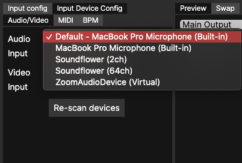

<h1>modV Workshop</h1>

> By using the open source software [modV](https://modv.vcync.gl/) you will be able to create audio reactive visualisations by combining different kinds of visual modules (2D, [Interactive Shader Format](https://isf.video/) and WebGL Shader) with any kind of audio input like a microphone or your favorite music. In the end you will know all the basics in order to do your first live performance as a VJ.

---

- [Prepare before the Workshop](#prepare-before-the-workshop)
  - [modV setup](#modv-setup)
  - [Audio Routing](#audio-routing)
  - [Download / clone the repository](#download--clone-the-repository)
- [Before we start...](#before-we-start)
  - [Who is behind modV?](#who-is-behind-modv)
  - [Where is modV being used?](#where-is-modv-being-used)
- [1. Get to know modV](#1-get-to-know-modv)
  - [Save / Load a preset](#save--load-a-preset)
  - [Add images into modV](#add-images-into-modv)
  - [Add modules into modV](#add-modules-into-modv)
- [Breakout Session A](#breakout-session-a)
- [2. Audio reactive visuals](#2-audio-reactive-visuals)
  - [Audio routing](#audio-routing-1)
- [Breakout Session B](#breakout-session-b)
- [3. Techniques to get certain effects](#3-techniques-to-get-certain-effects)
  - [Tunnel effect](#tunnel-effect)
  - [Background fade](#background-fade)
  - [Using a group as mask (text)](#using-a-group-as-mask-text)
  - [Hue rotation for trailing colors](#hue-rotation-for-trailing-colors)
- [Breakout Session C](#breakout-session-c)
- [4. Use modV for a live performance](#4-use-modv-for-a-live-performance)

---

# Prepare before the Workshop

If you have problems to prepare for the workshop, please make sure to reach out to us: [Tim Pietrusky](https://nerddis.co) or [Sam Wray](https://2xaa.fm)!

## modV setup

Install the [latest version of modV](https://github.com/vcync/modV/releases/latest). 

When you start modV, two windows should open: The **main window** and the **output window**. 

*modV main window*

*modV output window*

## Audio Routing

In order to get audio into modV to be able to visualize it, you need to [follow one of these guides for your operating system](https://modv.vcync.gl/v3/guide/#audio-routing). 

When everything works out, you can select your Audio Input under **Input Device Config**

*Audio Input Config*

If it doesn't work out, you can still use the microphone of your computer!

## Download / clone the repository

In order to get all files that are needed for the workshop, please [download](https://github.com/vcync/modV-Workshop/archive/main.zip) or clone the repository to your computer. 

The important folders are:

* [modules](/modules): Example modules to extend modV
* [presets](/presets): Configurations that will be used during the workshop

---

# Before we start...

In this workshop we are using modV 3.x, the latest version of modV that comes as a standalone desktop application. With modV, you can combine modules with each other to generate visual output. Every module has properties that can be updated in real time to change how the module is drawn. Each of these properties can also be updated automatically using audio features based on audio input (e.g. a microphone). 

## Who is behind modV?

* [Sam Wray](https://2xaa.fm), founder and core contributor
* [Tim Pietrusky](https://nerddis.co), core contributor

We are using modV for shows around the world for more than 4 years. 

## Where is modV being used?

* [Various videos & images of modV in action](https://photos.google.com/share/AF1QipPhz8zKecemmMxnMbFdhFo-__tSmrmqMQzrD4YkE1MUFq-FQxqgePMFure5h05SfA?key=eDRWNVhnVjE4SXU5N0xSNVpBQkw0SmRxQ0JCZjFn)
* [Performance of 2xAA & NERDDISCO for OPEN UP SUMMIT 2020 using modV 3.x](https://www.youtube.com/watch?v=RhM3arvVAPM)
* [A talk about modV 2.x at dotJS 2016](https://www.youtube.com/watch?v=GA7-OfYSzvA)

---

# 1. Get to know modV

Before we dive into creating audio reactive visuals, we want to explain how the UI of modV is structured so we can talk about the same things. 

* **A**: `Groups`. A Group contains modules. Modules within Groups can be arranged to change the drawing order. 
* **B**: `Module`. A module represents a visual element that draws something to the screen, like the `Text` module that can draw any kind of user generated text to the `Main Output`
* **C**: `Info View`. Shows information about the different panels in modV when you hover over them using your mouse. 
* **D**: `Gallery`. Contains all modules that can be added to a `Group`. Modules are categorized as `2D` (Canvas 2D), `ISF` (Interactive Shader Format) and `Shader` (WebGL Shader / GLSL). You can either scroll the list or use the search box at the top to find a specific module. 
* **E**: 

TODO: Basics to work with modV, groups, layers, add modules, preview output

DEMO : Basic animation with build in modules

## Save / Load a preset

tbd

## Add images into modV

tbd

## Add modules into modV

* Taking stuff from other people
   * Shadertoy License
   * CodePen License
   * Make clear that taking resources from someone else should always be credited as we don’t want to steal anyone's work AND check the license
* Load the shader from Diana & Eliza
* ISF
   * Provide a guide on how to load your own shaders + parameterize them into modV (advanced)
      * And mention this one for people that are way to fast

---

# Breakout Session A

---

# 2. Audio reactive visuals

* Use Audio reactive parameters, smoothing, blend modes of layers
* Load a custom shader from Diana / Eliza into modV
* Load custom image like a logo

Demo: Custom image + Audio reactive scale using the microphone

## Audio routing

* Get external audio into modV, 
* ?use the output window?

Demo: Audio routing with external audio source

---

# Breakout Session B

---

# 3. Techniques to get certain effects

TODO: Please add a preset for each effect into [presets](/presets)!

## Tunnel effect

## Background fade

## Using a group as mask (text)

Isn't this when I usually do "Blend > Source In" on the elements after the Text (or any other path)?

## Hue rotation for trailing colors

---

# Breakout Session C

---

# 4. Use modV for a live performance

   * How to recover from a crash
   * How to use MIDI
   * Record the Video with OBS
     * Second screen for the output window
   * Streaming with OBS
   * Collaborate over Remote Desktop 
     * If we can make this work :D

---

2020 by [Sam Wray](https://2xaa.fm) & [Tim Pietrusky](https://nerddis.co)