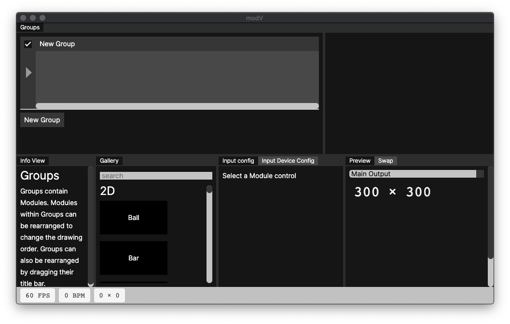

<h1>modV Workshop</h1>

> By using the open source software [modV](https://modv.vcync.gl/) you will be able to create audio reactive visualisations by combining different kinds of visual modules (2D, [Interactive Shader Format](https://isf.video/) and WebGL Shader) with any kind of audio input like a microphone or your favorite music. In the end you will know all the basics in order to do your first live performance as a VJ.

---

- [Prepare before the Workshop](#prepare-before-the-workshop)
  - [modV Main Window](#modv-main-window)
  - [modV Output Window](#modv-output-window)

---

## Prepare before the Workshop

Install the [latest version of modV](https://github.com/vcync/modV/releases/latest). Then start modV and see if it comes up like this:

### modV Main Window

### modV Output Window

If you have problems, please make sure to reach out to us: [Tim Pietrusky](https://nerddis.co) or [Sam Wray](https://2xaa.fm)!

---

2020 by [Sam Wray](https://2xaa.fm) & [Tim Pietrusky](https://nerddis.co)